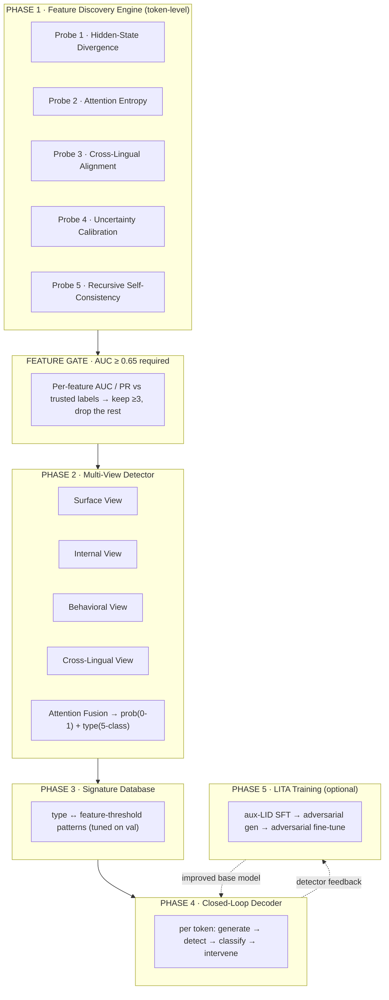

# IndraLLM — Build Instructions for a Code-Switched Hallucination Detection & Mitigation System

> **For the implementing agent (Claude Code).** This is a specification, not a codebase. It tells you *what to build, in what order, and how to prove each part works before the next is allowed to exist.* Do not paste this text into source files. Write real modules that satisfy the specs below. Every diagram, table, and interface here is a contract you implement.

---

## 0. Read this first — the one rule that governs everything

IndraLLM is an **empirically gated** system. Components are built in dependency order, and **each stage must pass a measured bar before the next stage is written.** A feature that does not separate hallucinated from correct answers on trusted labels is deleted, not shipped. A detector head that a feature does not feed is not built. This is the difference between a system that works and a diagram that looks like it works.

The single hard gate:

> **If, after honest labeling, no internal feature reaches ROC-AUC ≥ 0.65 against the hallucination label, STOP. Do not build the multi-view detector, the signature database, or the closed-loop decoder.** Return to feature discovery and probe new signals. The whole system's value is a detector that actually fires on real hallucinations — nothing downstream rescues a detector that doesn't.

Everything else in this document is subordinate to that rule.

---

## 1. What IndraLLM is

A research system that **detects and corrects hallucinations in real time** when a language model answers questions written in **code-switched Indian-language text** — Tamil, Hindi, Telugu, Bengali, or Kannada mixed with English (romanized or native-script). It targets the failure mode monolingual detectors ignore: when a model's output degrades *at and around language-switch points*.

Three contributions, in order of dependency:

1. **A feature-discovery engine** that reads the base model's own internals — hidden-state trajectories, attention entropy, cross-lingual embedding alignment, token-level uncertainty, and multi-sample consistency — and turns them into token-level signals.
2. **A multi-view detector** that fuses those internal signals with surface linguistic features and output-behavior features, producing (a) a hallucination probability and (b) an anomaly *type*.
3. **A closed-loop decoder** that runs the detector *inside* the generation loop and applies a type-specific correction the instant a hallucination begins to form.

Built on the existing IndraLLM benchmark: ~2,000+ `(question, model_answer, gold_answer)` triples across five code-switched language pairs, four answering models.

---

## 2. System architecture



Data flow at inference (closed loop):

```
prompt ─▶ base model logits ─▶ candidate token
                                     │
                          ┌──────────▼───────────┐
                          │  Multi-View Detector  │  prob p, type t
                          └──────────┬───────────┘
                   p < τ  ┌──────────┴───────────┐  p ≥ τ
              accept ◀────┤   threshold τ = 0.65  ├────▶ signature match → intervene(t)
                          └──────────────────────┘            │
                                     ▲                         ▼
                                     └───── updated state ◀── final token
```

---

## 3. Repository layout to create

Extend the existing package; do not fork it. Target structure:

```
src/indrallm/
  detection/
    lidar/
      lid.py                 # token-level language ID (EXISTS — reuse/extend)
      features.py            # surface/boundary features (EXISTS — extend)
      probe.py               # feature AUC gate (EXISTS — reuse as the gate)
      internal_probes.py     # NEW · HSD, AE, UC extraction from base-model internals
      self_consistency.py    # NEW · RSC (multi-sample) probe
      cross_lingual.py       # NEW · CLA probe
      feature_cache.py       # NEW · extract-once, cache to parquet, keyed by qid|model
    multi_view/
      views.py               # NEW · four view encoders
      detector.py            # NEW · fusion + prob head + type head
      train.py               # NEW · train/val loop
    signatures.py            # NEW · signature database (JSON-backed lookup)
  mitigation/
    lidar_decoder.py         # NEW · closed-loop decoder wrapping base model
    interventions.py         # NEW · the four correction strategies
    lita_trainer.py          # NEW · optional adversarial training
  evaluation/
    run_benchmark.py         # EXISTS — extend with detector + mitigation tables
    feature_report.py        # NEW · writes docs/feature_analysis.md
data/
  final/
    benchmark_judged.csv     # trusted labels (LLM-judge) — the ONLY label source for gating
    train.csv val.csv test.csv   # stratified splits on judged labels
  features/                  # cached probe features (parquet), one file per probe
docs/
  feature_analysis.md        # NEW · feature ranking + chosen thresholds
  RESULTS.md                 # NEW · final metrics tables
```

---

## 4. Non-negotiable data-correctness requirement (read before Task 1)

The original benchmark labels came from `BERTScore(model_answer, English gold)`. This is **broken and must not be used for gating or training**: the gold answers are ~94% English, so any answer written in Indic scores low and gets mislabeled "hallucinated." Measured leakage: `corr(fraction_indic, old_label) = +0.52`. A detector trained on that learns "answered in Indic," not "hallucinated."

**Requirement:** all AUC gates, detector training, and reporting use `data/final/benchmark_judged.csv` — labels from a language-agnostic **LLM-judge** that reads `(question, gold, answer)` and rules on *factual* correctness regardless of surface language. Empty answers are dropped. Before trusting any feature, confirm `corr(fraction_indic, label)` is near zero on the label set you use; if it is not, the labels are still confounded and no feature result is meaningful.

---

## 5. Phase 1 — Feature Discovery Engine

Five probes. Each reads the **base model (Sarvam-2B)** running over the *model_answer* conditioned on the *question*, and emits token-level features. Extract once, cache to `data/features/*.parquet` keyed by `qid|model`, so downstream stages never re-run the model.

| # | Probe | What it measures | Per-token outputs |
|---|-------|------------------|-------------------|
| 1 | **Hidden-State Divergence (HSD)** | cosine *distance* between consecutive token hidden states, per decoder layer | layerwise HSD vector, mean, max, variance, and slope over a 3–5 token window |
| 2 | **Attention Entropy (AE)** | Shannon entropy of each head's attention over context tokens | headwise AE, layer-mean AE, global mean AE, spike flag (>mean+2σ) |
| 3 | **Cross-Lingual Alignment (CLA)** | cosine similarity of embeddings on either side of a language-switch boundary (boundaries from `lid.py`) | per-boundary CLA, CLA trajectory, largest drop magnitude |
| 4 | **Uncertainty Calibration (UC)** | logit spread vs confidence: `UC = 1 − confidence/(1+logit_variance)` | logit variance, max-softmax confidence, UC |
| 5 | **Recursive Self-Consistency (RSC)** | agreement across 5 re-sampled generations of the same prompt | per-position unique-token ratio (diversity); low = consistent |

**Specifications:**

- **HSD / AE / UC** come from a *single* forward pass with `output_hidden_states=True, output_attentions=True` over the fixed answer — no generation needed, cheap. Aggregate the per-token, per-layer tensors into the scalars above; store both the raw layerwise vectors (for the detector's Internal View) and the aggregates (for the gate and signature DB).
- **CLA** depends on the existing token-level LID (`lid.py`). A "boundary" is any adjacent token pair whose language labels differ and neither is `other`. Use a multilingual sentence/word encoder for the embeddings (already a project dependency) — never an English-only encoder, or CLA re-introduces the language confound.
- **RSC** is the only probe that generates. It is expensive (5× decode). Make it optional behind a flag and cache aggressively; a hallucinated span should show higher token diversity across seeds than a well-grounded one.
- All probes must degrade gracefully: missing attentions, single-token answers, or an unavailable multilingual encoder return neutral values, never crash.

**Deliverable:** `feature_cache.py` produces one parquet per probe plus a joined `data/features/all_features.parquet` at row granularity `qid|model|token_index`, and a second **answer-level** aggregation (mean/max/slope of each feature over the answer) for the answer-level detector and gate.

---

## 6. THE GATE — Phase 1 → Phase 2

Before any detector is written, run `feature_report.py`:

- For every feature (the five internal probes **plus** the existing surface features: switch rate, fraction-indic, fraction-en, n_tokens, boundary-coherence), compute **ROC-AUC, PR-AUC, and precision/recall at operating thresholds** against the judged label on the **validation** split.
- Explicitly report `corr(feature, fraction_indic)` for each, to catch any feature that is merely a language proxy.
- Write a ranked table to `docs/feature_analysis.md` with a **KEEP / DROP** decision per feature and a recommended threshold + operator for those kept.

**Pass condition:** at least **three** features with AUC ≥ 0.65 that are *not* explained by `fraction_indic`. If met, proceed. If not met, **stop and report** — add probes (e.g. contrastive hidden-state divergence between full vs Indic-stripped prompt, or per-layer probing classifiers) and re-gate. Do not soften the bar.

---

## 7. Phase 2 — Multi-View Detector

Only the features that passed the gate enter here. Four views, each a small sequence encoder (GRU or shallow MLP — **not** a large Transformer; latency budget matters):

| View | Fed by | Purpose |
|------|--------|---------|
| **Surface** | LID sequence, switch frequency, OOV rate, (optional POS) | linguistic shape of the answer |
| **Internal** | HSD, AE, UC (+ RSC if kept) — the passed internal probes | model's own signs of trouble |
| **Behavioral** | perplexity trajectory, repetition score (repeated-n-gram ratio), logit variance | output-level degradation |
| **Cross-Lingual** | CLA sequence, semantic-shift flag | rupture at switch points |

**Fusion:** a multi-head cross-attention block lets views exchange information, then an **attention-based fusion** layer produces *per-input* view weights (so the detector can rely on the internal view for one sample and the cross-lingual view for another). Two heads on the fused representation:

- **Probability head** — sigmoid, binary hallucination probability.
- **Type head** — 5-way softmax: `NONE, UNINTENDED_SWITCH, FACTUAL_ERROR, SEMANTIC_DRIFT, REPETITION`.

**Training spec:** AdamW, lr 1e-4, batch 16, class-weighted BCE for the probability head + cross-entropy for the type head, early-stop on val PR-AUC. Type labels for the four hallucination classes are derived from signature matching on the training split (Phase 3) plus the judge's free-text reason where it disambiguates; `NONE` = judged correct. Report per-language AUC — no single language pair may fall below 0.70 in the final system.

---

## 8. Phase 3 — Signature Database

A JSON-backed lookup mapping each anomaly type to a logical pattern over kept features, tuned on validation. Interface: given an answer-level (or span-level) feature vector, return the best-matching type or `NONE`. Starting hypotheses (tune the thresholds — do not hardcode blindly):

| Type | Pattern (illustrative — retune on val) | Intervention |
|------|----------------------------------------|--------------|
| `UNINTENDED_SWITCH` | CLA < 0.4 **and** AE > 0.8 | constrain next-token language |
| `FACTUAL_ERROR` | UC > 0.7 **and** RSC < 0.3 | fact-aware re-rank of top-k |
| `SEMANTIC_DRIFT` | HSD slope > 0.2/token **and** HSD var > 0.5 | roll back 2 tokens, regenerate |
| `REPETITION` | AE < 0.3 **and** repetition score > 0.6 | apply repetition/diversity penalty |

Schema per entry: `{features: [...], conditions: [{feature, op, value}], intervention: <name>}`. Any type whose defining features were **dropped at the gate** must be removed from the database — you cannot key a signature on a signal you proved is noise.

---

## 9. Phase 4 — Closed-Loop Decoder

Wrap the base model's decode loop. Per step:

1. Get base-model logits; propose a candidate token.
2. Run the detector on the partial output (reuse cached internal state; do **not** re-encode from scratch each step — incremental update only, to hold the latency budget).
3. If `p < τ` (τ = 0.65) → accept, update state, continue.
4. If `p ≥ τ` → match the signature database to get the type.
5. Apply the type's intervention:
   - **Language constraint** — bias logits toward the expected language(s) inferred from the prompt's LID profile.
   - **Fact re-rank** — expand top-k candidates, score each with a lightweight NLI/entailment check against the question context, pick the most entailed.
   - **Rollback** — drop the last 2 tokens, regenerate with a diversity penalty on the discarded continuation.
   - **Repetition penalty** — down-weight logits of tokens seen in the last N positions.
6. Emit the final token; update detector state.

**Hard constraint:** total detector+intervention overhead **< 20%** of baseline generation time. This is why the views are GRUs and the detector state is incremental. Measure and report overhead; if exceeded, shrink the detector, not the benchmark.

---

## 10. Phase 5 — LITA Training (optional, only if Phase 4 works)

Three stages, run only after the closed-loop system beats baseline:

1. **Auxiliary-LID SFT** — add a per-token language-ID head (6 classes: English + 5 Indic) on the base model; train on the benchmark with LID labels from `lid.py`; loss `= LM + 0.1·LID`.
2. **Adversarial generation** — generate answers with the current model, run the detector, and for each detected hallucination synthesize three variants: **language-swap** (translate content words), **boundary-shift** (move the switch ±1–2 tokens), **bleed-insert** (inject dominant-language words at switches). Pair each with the corrected gold target.
3. **Adversarial fine-tune** — loss `= LM(gold) + α·LM(adv→corrected) + β·KL(LID_pred ‖ LID_target) + γ·BCE(detector(gen), not-hallucinated)`.

Report reduction from LITA *separately* from the closed-loop reduction so contributions are attributable.

---

## 11. Implementation order (do not reorder)

1. Environment + confirm base model loads in 4-bit on a free Colab T4.
2. Confirm `benchmark_judged.csv` exists and `corr(fraction_indic, label) ≈ 0`; build stratified 70/15/15 splits.
3. Extend token-level LID; emit per-token language sequences + switch boundaries.
4. Build `internal_probes.py`, `cross_lingual.py`, `self_consistency.py`; cache all features.
5. **Run the gate** (`feature_report.py`). Obey Section 6. **← decision point.**
6. Build + train the multi-view detector on kept features.
7. Build the signature database; tune thresholds on val.
8. Build the closed-loop decoder + interventions; verify latency budget.
9. Full evaluation vs baselines; write `docs/RESULTS.md`.
10. (Optional) LITA; re-evaluate.

---

## 12. Evaluation & success criteria

Compute on the **test** split, per-language and overall:

| Axis | Metric | Target |
|------|--------|--------|
| Detection | ROC-AUC, F1, precision, recall | **AUC > 0.75** |
| Detection robustness | per-language AUC | **no pair < 0.70** |
| Mitigation | `(base_halluc − mitigated_halluc)/base_halluc` | **> 30% reduction** |
| Efficiency | per-token time vs baseline | **overhead < 20%** |

**Baselines to beat:** vanilla base model (no mitigation), BERTScore-threshold detection, NLI-entailment detection. Report all in `docs/RESULTS.md` as tables with per-language breakdowns.

**Honesty clause:** report the numbers you measure. If detection AUC lands below 0.75 or reduction below 30%, say so and diagnose — a truthful sub-target result is a valid outcome and more useful than a tuned-to-the-test fiction.

---

## 13. Technical constraints

- **Hardware:** everything must run on a free Colab T4 (16 GB). Load Sarvam-2B in 4-bit.
- **Latency:** detector uses lightweight recurrent/MLP encoders, incremental state — never a second large model in the hot loop (the NLI fact-checker runs only on the rare `p ≥ τ` branch).
- **Reproducibility:** fixed seeds, cached features, scripted end-to-end; document every module with a docstring and a usage line in the README.
- **Data hygiene:** never train, tune, or threshold on the test split; the gate and signature thresholds use validation only.

---

## 14. Deliverables

1. Modular Python package matching Section 3, each module documented.
2. Cached feature parquets + trained detector weights.
3. `docs/feature_analysis.md` (gate results, kept/dropped features, thresholds).
4. `docs/RESULTS.md` (detection, mitigation, latency, per-language, baseline comparison).
5. Scripts/notebooks reproducing every table.
6. A README section describing the system, how to run each phase, and its measured limitations.

---

## 15. Start here

Verify Section 4 (trusted labels, confound check) is satisfied, build the splits, then implement probes in order and **run the gate before writing the detector.** Let the measured AUC decide whether Phases 2–5 get built. Build the system the data supports — not the diagram.
