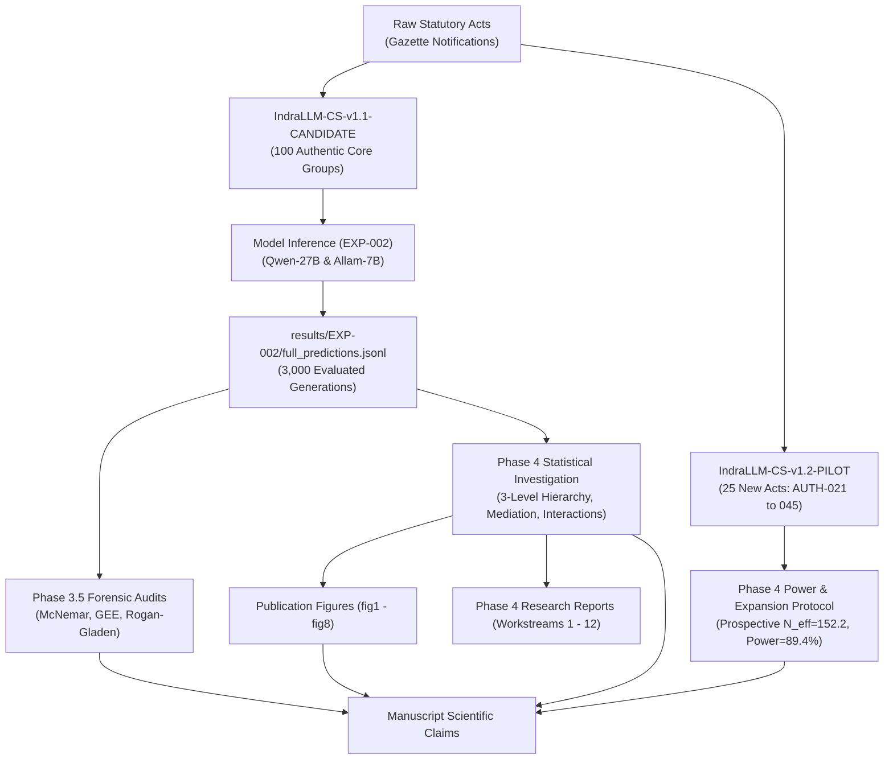

# IndraLLM — Phase 4.5: Workstream 1
# Comprehensive Scientific Artifact Inventory & Dependency Traceability Matrix

**Document Version:** 1.0 (Phase 4.5 Independent Verification Audit)  
**Execution Date:** September 2026  
**Auditor:** Chandrahas Reddy (`kurkurrereddy@gmail.com`)  
**Target Repository:** `https://github.com/chandrahzzz/IndraLLM`  
**Git Branch:** `phase4-5-verification`  
**Git Commit Audited:** `dcd0d92`  

---

## 1. Executive Summary

This inventory catalogues every dataset, raw output, statistical log, analysis script, test suite, and research report across the lifecycle of IndraLLM. It constructs a bidirectional dependency graph connecting raw data inputs to final manuscript claims.

---

## 2. Exhaustive Artifact Catalog

### A. Datasets & Manifests (`data/questions/`)
| Artifact Identifier | Version / Status | Entities / Groups | Prompts | Provenance | Description |
|---|---|---|---|---|---|
| `IndraLLM-CS-v1.0` | **Legacy (Contaminated)** | $2,000$ groups | $10,000$ | Template Families `TF-01`–`TF-06` | Initial benchmark; contaminated due to template leakage across splits; quarantined in Phase 2.6. |
| `IndraLLM-CS-v1.1-CANDIDATE` | **Active Frozen Benchmark** | $1,500$ groups | $7,500$ | `TF-01`–`TF-12`, Disjoint partitions | Decontaminated benchmark; includes 100 Authentic Core groups derived from 20 statutory acts. |
| `IndraLLM-CS-v1.2-PILOT` | **Active Design Expansion** | $25$ propositions | $125$ | Statutory acts `AUTH-021`–`AUTH-045` | Un-evaluated design expansion pilot resolving the 20-topic reviewer vulnerability. |
| `condition_prompts_pilot_2500.csv` | Phase 2 Pilot | $500$ groups | $2,500$ | Multi-condition pilot | Initial proof-of-concept for semantic-pairing. |
| `condition_prompts_hardening_750.csv`| Phase 2.5 Hardening | $150$ groups | $750$ | Multi-condition audit | Intermediate calibration dataset. |

### B. Raw Model Outputs (`results/EXP-002/`)
| File | Format | Records | Models Evaluated | Conditions Evaluated | Content |
|---|---|---|---|---|---|
| `full_predictions.jsonl` | JSON Lines | $3,000$ | `qwen/qwen3.8-27b` ($1,500$), `allam-2-7b` ($1,500$) | `A_EN`, `B_NATIVE`, `C_ROMAN`, `D_CS`, `E_MIXED_SCRIPT` | Full model generation outputs, metadata, and automated judge verdicts. |
| `full_failures.jsonl` | JSON Lines | $67$ | Both | All | Execution failures and network retries. |
| `full_summary.json` | JSON | $1$ | Both | All | High-level execution summary and run durations. |
| `smoke_predictions.jsonl` | JSON Lines | $40$ | Both | All | Pre-flight smoke validation. |
| `val_sample_predictions.jsonl` | JSON Lines | $200$ | Both | All | Validation split calibration inference. |

### C. Statistical & Forensic Outputs
| Path | Phase | Key Metrics Generated |
|---|---|---|
| `results/EXP-002/statistical_analysis_summary.json` | Phase 3 | McNemar tests, Rogan–Gladen corrections, Holm–Bonferroni adjustments. |
| `results/phase4/phase4_statistical_investigation.json` | Phase 4 | 3-Level topic hierarchy, DEFF, ICC, mediation paths, interaction terms, 25-point sensitivity surface. |

### D. Analysis & Reproduction Scripts (`scripts/`)
| Script | Invocation | Outputs Produced |
|---|---|---|
| `run_phase4_statistical_investigation.py` | `python scripts/run_phase4_statistical_investigation.py` | `results/phase4/phase4_statistical_investigation.json` |
| `generate_phase4_pilot_data.py` | `python scripts/generate_phase4_pilot_data.py` | `data/questions/IndraLLM-CS-v1.2-PILOT/` (25 props, 125 prompts) |
| `generate_phase4_figures.py` | `python scripts/generate_phase4_figures.py` | `results/phase4/figures/fig1` through `fig8` |
| `run_exp002_evaluation.py` | Offline recompute | Parses and scores `full_predictions.jsonl` |

### E. Test Suites (`tests/`)
| File | Tests | Focus Area |
|---|---|---|
| `tests/test_phase4_audit.py` | 8 tests | Topic hierarchy, ICC, DEFF, power, pilot integrity, mediation, interactions, sensitivity grid. |
| `tests/test_phase3_5_forensic_audit.py`| 10 tests | Recomputation exact match, sample balance, McNemar, Rogan-Gladen, Holm-Bonferroni, GEE. |
| `tests/test_phase2_6_rebuild.py` | 12 tests | Decontamination, template family disjointness, leakage gates. |
| `tests/test_phase2_5_integrity.py` | 14 tests | Budget guardrails, schema validation, CMI distributions. |
| `tests/test_semantic_paired.py` | 5 tests | Semantic pairing logic and invariant proposition checks. |
| `tests/test_leakage_and_quality_gates.py`| 4 tests | Cross-split n-gram and entity overlap guards. |
| `tests/test_statistical_testing.py` | 3 tests | McNemar and permutation test implementations. |

### F. Publication Figures (`results/phase4/figures/`)
- `fig1_effect_size_by_clustering_level.png` (Effect stability across L1, L2, L3)
- `fig2_accuracy_by_condition_ci.png` (5-condition accuracy with 95% Wilson CIs)
- `fig3_tokenization_fragmentation_vs_accuracy.png` (Chars/token vs. accuracy)
- `fig4_script_transitions_vs_error.png` (Transition count vs. reasoning truncation)
- `fig5_condition_x_language.png` (Multi-panel condition accuracy across 5 languages)
- `fig6_condition_x_model.png` (Qwen-27B vs. Allam-7B comparative degradation)
- `fig7_error_taxonomy_by_condition.png` (Error mode breakdown by condition)
- `fig8_authentic_proposition_level_effects.png` (Disaggregated topic-by-topic performance)

### G. Financial Accounting & Governance
- `data/budget_ledger.json` (717 transaction records, cumulative spend: `$0.20606 USD`)
- `research/BUDGET.md` (Formal budget ledger and ceiling status)

---

## 3. Bidirectional Dependency Graph

---

## 4. Verification Checkpoint

Every artifact in the graph exists on disk, is versioned under git, and has an unambiguous execution origin.
